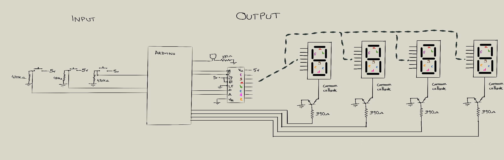

#ArduinoClock

##Components

- 1x Arduino board (Uno, Nano)
- 8x 330Ω resistors.
- 3x high value resistor (e.g.: 470000Ω).
- 4x 390Ω resistors.
- 4x 7-segments display. Common cathode.
- 3x buttons.
- 4x 2N5551 NPN transistors.
- 1x CD4511BE BCD-to-7-segment decoder.
- 1x buzzer.

##Scheme

##Videos
###2018
Running in an Arduino Nano, it's build on a bakelite board. Instead of using four different 7-segments display I use a four digit 7-segment display:

###2015
Running in an Arduino One, unlike the 2018 version, it has an additional led that is on when the alarm is on:
[Youtube video](https://www.youtube.com/watch?v=3Vp3RKkvZ58)